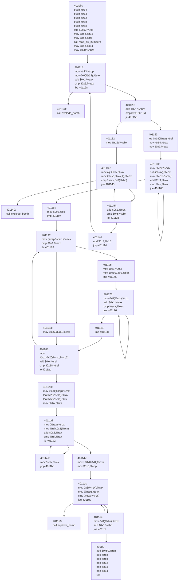

```mermaid
graph
	4010f4["<div align='left'>4010f4:<br/>push %r14<br/>push %r13<br/>push %r12<br/>push %rbp<br/>push %rbx<br/>sub $0x50,%rsp<br/>mov %rsp,%r13<br/>mov %rsp,%rsi<br/>call read_six_numbers<br/>mov %rsp,%r14<br/>mov $0x0,%r12d<br/></div>"]
	401114["<div align='left'>401114:<br/>mov %r13,%rbp<br/>mov 0x0(%r13),%eax<br/>sub $0x1,%eax<br/>cmp $0x5,%eax<br/>jbe 401128<br/></div>"]
	401123["<div align='left'>401123:<br/>call explode_bomb<br/></div>"]
	401128["<div align='left'>401128:<br/>add $0x1,%r12d<br/>cmp $0x6,%r12d<br/>je 401153<br/></div>"]
	401132["<div align='left'>401132:<br/>mov %r12d,%ebx<br/></div>"]
	401135["<div align='left'>401135:<br/>movslq %ebx,%rax<br/>mov (%rsp,%rax,4),%eax<br/>cmp %eax,0x0(%rbp)<br/>jne 401145<br/></div>"]
	401140["<div align='left'>401140:<br/>call explode_bomb<br/></div>"]
	401145["<div align='left'>401145:<br/>add $0x1,%ebx<br/>cmp $0x5,%ebx<br/>jle 401135<br/></div>"]
	40114d["<div align='left'>40114d:<br/>add $0x4,%r13<br/>jmp 401114<br/></div>"]
	401153["<div align='left'>401153:<br/>lea 0x18(%rsp),%rsi<br/>mov %r14,%rax<br/>mov $0x7,%ecx<br/></div>"]
	401160["<div align='left'>401160:<br/>mov %ecx,%edx<br/>sub (%rax),%edx<br/>mov %edx,(%rax)<br/>add $0x4,%rax<br/>cmp %rsi,%rax<br/>jne 401160<br/></div>"]
	40116f["<div align='left'>40116f:<br/>mov $0x0,%esi<br/>jmp 401197<br/></div>"]
	401176["<div align='left'>401176:<br/>mov 0x8(%rdx),%rdx<br/>add $0x1,%eax<br/>cmp %ecx,%eax<br/>jne 401176<br/></div>"]
	401181["<div align='left'>401181:<br/>jmp 401188<br/></div>"]
	401183["<div align='left'>401183:<br/>mov $0x6032d0,%edx<br/></div>"]
	401188["<div align='left'>401188:<br/>mov %rdx,0x20(%rsp,%rsi,2)<br/>add $0x4,%rsi<br/>cmp $0x18,%rsi<br/>je 4011ab<br/></div>"]
	401197["<div align='left'>401197:<br/>mov (%rsp,%rsi,1),%ecx<br/>cmp $0x1,%ecx<br/>jle 401183<br/></div>"]
	40119f["<div align='left'>40119f:<br/>mov $0x1,%eax<br/>mov $0x6032d0,%edx<br/>jmp 401176<br/></div>"]
	4011ab["<div align='left'>4011ab:<br/>mov 0x20(%rsp),%rbx<br/>lea 0x28(%rsp),%rax<br/>lea 0x50(%rsp),%rsi<br/>mov %rbx,%rcx<br/></div>"]
	4011bd["<div align='left'>4011bd:<br/>mov (%rax),%rdx<br/>mov %rdx,0x8(%rcx)<br/>add $0x8,%rax<br/>cmp %rsi,%rax<br/>je 4011d2<br/></div>"]
	4011cd["<div align='left'>4011cd:<br/>mov %rdx,%rcx<br/>jmp 4011bd<br/></div>"]
	4011d2["<div align='left'>4011d2:<br/>movq $0x0,0x8(%rdx)<br/>mov $0x5,%ebp<br/></div>"]
	4011df["<div align='left'>4011df:<br/>mov 0x8(%rbx),%rax<br/>mov (%rax),%eax<br/>cmp %eax,(%rbx)<br/>jge 4011ee<br/></div>"]
	4011e9["<div align='left'>4011e9:<br/>call explode_bomb<br/></div>"]
	4011ee["<div align='left'>4011ee:<br/>mov 0x8(%rbx),%rbx<br/>sub $0x1,%ebp<br/>jne 4011df<br/></div>"]
	4011f7["<div align='left'>4011f7:<br/>add $0x50,%rsp<br/>pop %rbx<br/>pop %rbp<br/>pop %r12<br/>pop %r13<br/>pop %r14<br/>ret<br/></div>"]
    4010f4 --> 401114
    401114 --> 401128
    401114 --> 401123
    401128 --> 401153
    401128 --> 401132
    401132 --> 401135
    401135 --> 401145
    401135 --> 401140
    401145 --> 401135
    401145 --> 40114d
    40114d --> 401114
    401153 --> 401160
    401160 --> 401160
    401160 --> 40116f
    40116f --> 401197
    401176 --> 401176
    401176 --> 401181
    401181 --> 401188
    401183 --> 401188
    401188 --> 4011ab
    401188 --> 401197
    401197 --> 401183
    401197 --> 40119f
    40119f --> 401176
    4011ab --> 4011bd
    4011bd --> 4011d2
    4011bd --> 4011cd
    4011cd --> 4011bd
    4011d2 --> 4011df
    4011df --> 4011ee
    4011df --> 4011e9
    4011ee --> 4011df
    4011ee --> 4011f7
```
